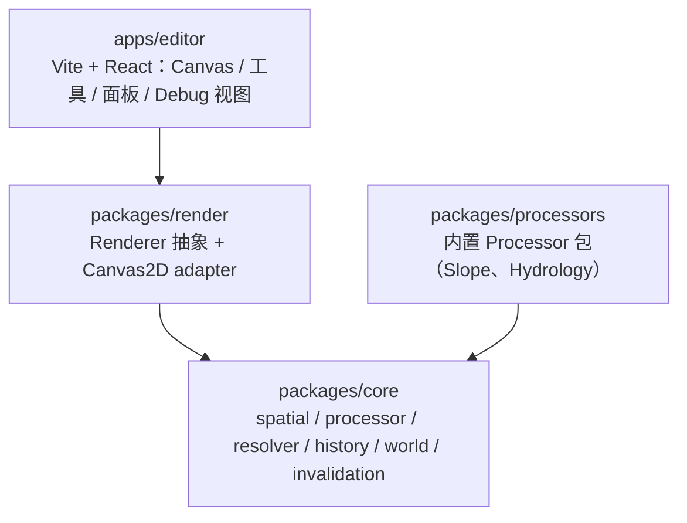
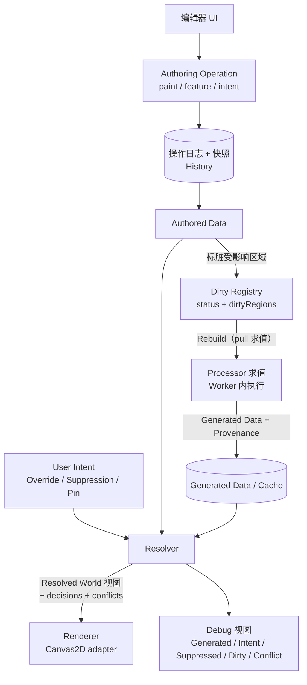

# World Authoring Engine 架构蓝图 v1

> **对应票**：[产出架构蓝图 v1（17 项输出）](https://github.com/XLBen/map-mapmap/issues/5)（Part of: [World Authoring Engine 路线图 #2](https://github.com/XLBen/map-mapmap/issues/2)）
> **状态**：草案 —— 待 [Spec Lock 评审 #6](https://github.com/XLBen/map-mapmap/issues/6)（HITL）逐项评审锁定后，才成为实施基线。
> **约束基准**：[docs/requirements/engine-charter.md](requirements/engine-charter.md)（66 条设计原则 + 16 条硬原则 + 14 步最小验证用例 + 已锁定决策 Q1–Q5）。
> **调研输入**（不在 main，按分支引用）：
> - [docs/research/prior-art.md](https://github.com/XLBen/map-mapmap/blob/research/prior-art/docs/research/prior-art.md)（branch `research/prior-art` @ `8f5bd72`）—— 同类系统先例：失效传播 / Suppression / Provenance / Plugin Lock。
> - [docs/research/hydrology-algorithms.md](https://github.com/XLBen/map-mapmap/blob/research/hydrology-algorithms/docs/research/hydrology-algorithms.md)（branch `research/hydrology-algorithms` @ `2400189`）—— D8/D∞/MFD 与局部增量更新。
> **撰写日期**：2026-10-02。
> **边界声明**：本文档不含任何应用代码；**不修改 charter 正文**；本文提出的 charter 问题、逻辑冲突与简化建议集中记录于 [§18](#18-charter-批判与更简方案6-评审专用)，按维护者拍板（2026-10-02, Q2）全部留 #6 人工逐条定夺。

---

## 0. 评审指南

本文按 charter「输出要求」逐项成节，①–⑰ 与要求一一对应，可逐条勾选评审；⑱ 与三个附录是 charter 额外要求的「主动批判」与交付附带物。

**评审清单**

- [ ] ① 当前代码库架构总结 → [§1](#-现状架构总结)
- [ ] ② 与理论模型的主要差距 → [§2](#-与理论模型的主要差距)
- [ ] ③ 第一阶段必须实现的原则 → [§3](#-第一阶段必须实现的原则)
- [ ] ④ 可延期项 → [§4](#-可延期项)
- [ ] ⑤ 建议的核心 domain model → [§5](#-核心-domain-model)
- [ ] ⑥ 建议的模块边界 → [§6](#-模块边界)
- [ ] ⑦ 数据流 → [§7](#-数据流)
- [ ] ⑧ Processor/Resolver/Renderer 边界 → [§8](#-processorresolverrenderer-边界)
- [ ] ⑨ World 文件模型 → [§9](#-world-文件模型)
- [ ] ⑩ History/Snapshot 模型 → [§10](#-historysnapshot-模型)
- [ ] ⑪ Dirty Region/invalidation 模型 → [§11](#-dirty-regioninvalidation-模型)
- [ ] ⑫ Plugin/semantic/schema 模型 → [§12](#-pluginsemanticschema-模型)
- [ ] ⑬ 最小 vertical slice → [§13](#-最小-vertical-slice)
- [ ] ⑭ 分阶段迁移计划 → [§14](#-分阶段迁移计划)
- [ ] ⑮ 风险和可能的过度设计点 → [§15](#-风险和可能的过度设计点)
- [ ] ⑯ 测试策略 → [§16](#-测试策略)
- [ ] ⑰ 第一阶段验收标准 → [§17](#-第一阶段验收标准)
- [ ] ⑱ charter 批判与更简方案（额外要求） → [§18](#18-charter-批判与更简方案6-评审专用)
- [ ] 附录 A 选型清单（候选库对比） → [附录 A](#附录-a-选型清单候选库对比)
- [ ] 附录 B CONTEXT.md 首批词条草案 → [附录 B](#附录-b-contextmd-首批词条草案)
- [ ] 附录 C ADR 候选清单 → [附录 C](#附录-c-adr-候选清单)

**评审时需要重点拍板的三处**（其余为技术细节，可在评审中顺带确认）：

1. §18 C1 —— Processor 是否允许以「Resolved World 整体」为输入（潜在成环，建议改为槽位级解析）。
2. §18 C2 —— Lock 与 Freeze 是否合并为单一 `Pin` 意图（影响 Resolver 复杂度与 UI 手势）。
3. §18 C5 —— Suppression 的对象匹配语义（本项目最高创新风险，§15 R1）。

---

## ① 当前代码库架构总结

**结论：空仓库。** 现状没有任何应用代码，只有需求文档与流程配置——这与票面「当前仓库为空仓库（无应用代码）」及 #2 的判断一致。

| 类别 | 现有物 | 说明 |
|---|---|---|
| 需求基准 | `docs/requirements/engine-charter.md`（420 行） | 唯一约束基准；含 66 条原则、16 条硬原则、14 步验证用例、17 项输出要求、已锁定 Q1–Q5 |
| 流程配置 | `AGENTS.md`、`docs/agents/{issue-tracker,triage-labels,domain}.md` | issue tracker = GitHub（deck_ 工具读写）；五角色 triage 标签；single-context 域文档约定（`CONTEXT.md` 与 `docs/adr/` 懒创建） |
| 调研产出（分支） | `research/prior-art` @ `8f5bd72`、`research/hydrology-algorithms` @ `2400189` | 各一份 Markdown，**都不在 main** |
| 应用代码 | 无 | 无 `package.json`、无构建、无测试、无 CI |
| 分支 | `main` @ `32fe43a`（干净） | 除 main 外只有两条 research 分支 |
| 票据 | [地图 #2](https://github.com/XLBen/map-mapmap/issues/2) + #3–#12 | #3/#4 已关闭；#5（本票）frontier；#6 HITL；#7–#12 锁在 #6 后 |

因而不存在任何可总结的「现有架构」——本蓝图的角色不是改造既有系统，而是**把 charter 的约束与两份调研的结论翻译成一套可实施、可测试的接口与模块边界**。

---

## ② 与理论模型的主要差距

差距是全面的（100% 组件缺失），但设计约束是完备的（charter + 调研 + Q1–Q5）。按 charter 的理论模型逐组件对照：

| 理论模型组件 | charter 依据 | 现状 | 承载票 |
|---|---|---|---|
| 通用空间数据类型（Scalar/Vector/Categorical/Point/Line/Polygon） | §5、硬 3 | 无 | #7 |
| Authored / Generated 分源保存 | §10、硬 7 | 无 | #7 #8 #9 |
| Processor = 纯 `Data→Data`，不原地修改输入 | §21 §22、硬 5/6 | 无 | #9 |
| Processor Graph（DAG、类型化端口、拓扑序） | §24 §25 | 无 | #9 |
| Resolver（优先级 / Suppression / Lock / Freeze / Conflict） | §55、硬 12 | 无 | #10 |
| User Intent（Override / Suppress / Lock / Freeze / Constraint） | §11–§20 §39、硬 11 | 无 | #8 #10 |
| Resolved World 作为 Renderer 与下游的读取面 | §54 §56 | 无 | #10 #12 |
| Dirty Region / Invalidation Policy / Tile | §29 §30 §31、硬 14 | 无 | #9 #11 |
| Outdated + 手动 Rebuild（含 cost hint 字段） | §32 | 无 | #9 |
| History：Operation Log + Snapshot、非破坏 Undo | §40–§43、硬 15 | 无 | #8 |
| Provenance / 稳定逻辑身份 | §19 | 无 | #9 #11 |
| Plugin Lock / World Format 与 Engine 版本分离 | §45–§48、硬 16 | 无 | #7 #11 |
| Renderer 只读 Resolved World（含 Debug 视图） | §34 §35 §38 §54 | 无 | #12 |
| 统一世界坐标 + `sample`/`query` 访问 | §26 §27 §28、硬 13 | 无 | #7 |
| LOD / Mipmap | §33、Q4 | 无 | #7（数据结构） #12（最小使用） |
| ViewPreset | §37 | 无 | 延期（§4） |

**被调研验证或修正的 charter 假设**（这部分不是差距，而是输入）：

| charter 假设 | 调研结论 | 对蓝图的影响 |
|---|---|---|
| §32 默认 Outdated + Rebuild，不做实时全量重算 | World Machine / QGIS / Houdini 三领域一致采用 pull 式求值 + 手动/按需触发（prior-art §0、§4.5）→ **成立**，第一版不需要后台调度器 | §11 采用 pull 求值，不引入调度器 |
| §31 Invalidation Policy 枚举（Local/Neighborhood/Downstream/…） | **不够**：WM 官方承认 tile 局部重算与全图重算结果不同，需外扩上下文 + 接缝混合（prior-art §3.1） | 策略增加 `context{padding, seam}` 字段（§11、§18 C3） |
| §29–§30 Tile / Dirty Region / 局部失效 | tile 级局部导出被商业工具验证可行，但「局部==全图」必须做成**可测试性质**，不能假设（prior-art §3.1、#4 调研 §3.1） | §11 定义 P1/P2 两条测试性质，进 ⑯/⑰ |
| §19 Provenance 记录 derived_from / processor / hash / seed | GRASS 范式：写入时顺手记录，成本≈0，机器可读（prior-art §2.18） | §5 Provenance 字段集直接采用 |
| §25 第一版 DAG 禁循环、未来 SimulationLoop | Blender Simulation Zone 印证「显式循环容器 + 跨迭代状态显式声明」（prior-art §1.9） | 循环仍延期，容器形态记录于 §4 |
| `Elevation + Rainfall → River` 的最小实现 | D8 + Priority-Flood 全管线，1024² 纯 JS 实测 ~375ms（#4 调研 §4.1） | §13 slice 直接采用；Phase-1 无需 WASM |

---

## ③ 第一阶段必须实现的原则

原则来源 = charter 16 条硬原则 +「工作方式」10 条 + 已锁定决策 Q1–Q5。逐条给出第一阶段的执行档位：**完整实现**（架构纵切必须自证）、**接口先行**（第一天进模型，实现最小或留空）、**延期**（§4 列明）。

| # | 硬原则（charter §66） | Phase-1 档位 | 落在哪里 |
|---|---|---|---|
| 1 | World 不是 Layer 集合 | 完整实现 | §5 WorldFile / DataItem；`layer` 不进核心（§15 R7 守卫） |
| 2 | Layer 只是 UI 管理概念 | 完整实现 | §6 `apps/editor`；core 零 layer 概念 |
| 3 | 核心只认识通用空间数据类型 | 完整实现 | §5 `SpatialType`；§12 schema 声明 |
| 4 | 具体概念通过 schema/semantic/metadata/plugin 声明 | 完整实现 | §12；扩展性证明用例（DragonActivity） |
| 5 | Processor = Data→Data；Renderer = Data→Visual | 完整实现 | §8 边界表 |
| 6 | Processor 不原地修改输入 | 完整实现 | §5 声明契约；§8；实现票验收项 |
| 7 | Authored 与 Generated 分源保存 | 完整实现 | §5 `DataOrigin`；§9 文件模型 |
| 8 | 用户明确意图优先 | 完整实现 | §5 `UserIntent`；§8 Resolver 优先级 |
| 9 | 用户创建的数据必须进入后续 Processor | 完整实现（14 步之 9–11） | §5 槽位解析；§18 C1 |
| 10 | 删除自动结果用 Suppression，不破坏 Generated | 完整实现 | §5 `suppress-*`；§10 持久化；§18 C5 |
| 11 | Override/Suppress/Lock/Freeze 都是持久 User Intent | 完整实现（Lock/Freeze 形态待 #6，见 §18 C2） | §5 `UserIntent` 联合类型 |
| 12 | Resolver 输出 Resolved World | 完整实现 | §5 `ResolvedWorld`；§8 |
| 13 | 统一空间坐标访问，不强制同分辨率 | 完整实现 | §5 `sample`/`query`；重采样矩阵本身延期（§4） |
| 14 | Tile / Dirty Region / local invalidation / LOD | **接口先行 + 真验证**（Q4 硬要求） | §11；单 tile 实例化（§18 C4）；LOD 只做数据结构 |
| 15 | 非破坏 History + Snapshot | 完整实现 | §10 |
| 16 | 世界保存 plugin/算法/参数/seed/version/hash | 完整实现 | §5 `Provenance`/`PluginLock`；§9 |

**Q1–Q5 落到第一阶段的具体含义**

- **Q2 技术栈**：TS monorepo；`packages/core` 零 DOM/React 依赖；Processor 默认可进 Web Worker；接口按 typed-array 进出，热点日后换 Rust/WASM 不改接口。
- **Q3 渲染后端**：Canvas 2D 先行；Renderer 接口禁止暴露 Canvas API（核心只传标准化 render input/viewport/style/resolved data）。
- **Q4 规模**：~1024² 或少量真实 tile；Tile/DirtyRegion/InvalidationPolicy/LOD 接口第一天进核心；**必须真实验证局部失效不退化成全图重算**。
- **Q5 UI**：极简工作台 = Canvas + Elevation 笔刷 + Manual River 线工具 + 删除生成要素→Suppression + Undo/Redo + Rebuild + 调试面板（Resolved/Generated/Intent/Suppressed/Dirty/Conflict 切换）+ 最小状态栏。UI 是架构验证仪器。

**第一阶段不可让步的十条不变量**（实施票验收时逐条核对）

1. 核心源码中不出现任何具体世界概念（River/Biome/Magic…）——只出现类型与语义字符串。
2. 生成数据与作者数据在任何存储、任何内存视图中都可区分来源。
3. Processor 求值是纯函数：同 input + plugin + params + seed → 同 output；不写回输入。
4. Processor 图必须可拓扑排序（环检测在入图时失败即拒绝）。
5. Renderer 只读 Resolved World（Debug 视图例外，且显式标注）。
6. 编辑只产生 Authoring Operation 与 User Intent，不直接改派生结果。
7. 局部重算必须通过 P1/P2 性质测试（§11、§16），不允许退化为「每次都全图重算」。
8. Generated Cache 可整体删除且世界仍可完整重建。
9. 世界文件自带 Plugin Lock；旧世界不因插件升级而悄悄改变结果。
10. Undo 只撤销操作 + 标脏 + 重算，不逐级倒推派生结果。

---

## ④ 可延期项

延期判据（charter「工作方式」第 4/10 条）：**它解决的是当前真实问题，还是未来假设问题？** 以下各项在第一阶段只保留接口/字段（若接口成本为零），不投入实现。

| 延期项 | 依据 | 为什么现在不做 | 毕业条件 |
|---|---|---|---|
| D∞ / MFD、侵蚀、湖库演算 | #4 调研 §1.3、§5.4 | 发散型方法需额外收敛阈值规则（隐式业务逻辑），且 D8 已满足「单像素河道→LineFeature」 | 出现 D8 无法表达的真实需求时 |
| D8 路径级 Δ 增量更新 | #4 调研 §3.2 #2 | 1024² 全量重算 375ms 已达标；增量最坏仍是 O(n)，收益 < 复杂度与正确性风险 | slice 性能数据显示需要 |
| 多 tile 实装 / 16384² 压测 | Q4、#2「Not yet specified」 | 单 tile 即可验证全部架构性质；压测是独立性能票 | slice 验收后按蓝图毕业 |
| 完整 LOD/Mipmap 金字塔 | §33、Q4 | Q4 只要求「先有数据结构/最小实现」 | 大世界票 |
| ViewPreset 管理、Simple/Advanced 双模式、属性检查器、图层面板成品 | §13 §37、Q5 暂缓清单 | 需求方明确暂缓（Q5）；不影响架构正确性 | 后续 effort |
| SimulationLoop（循环容器） | §25、prior-art §1.9 | 第一版 DAG 禁循环是刻意约束 | 出现真实迭代收敛需求 |
| 单位系统校验（如禁止 Elevation+Temperature 直接相加） | §49 | 单位先作为 schema 元数据记录；强校验属于类型系统扩张 | 输入绑定层成熟后 |
| Capability Resolution（elevation-like scalar field 匹配） | §24 后半 | Phase-1 精确 semantic 匹配已够；模糊匹配引入歧义 | 出现同义语义竞争时 |
| cost hint 驱动的自动重算 | §32 尾 | 调研三领域一致选择手动/按需触发；自动调度器是复杂度 | 有实测的便宜 Processor 且用户抱怨时 |
| Collapse/压平（把 N 层合并为一层） | prior-art §4.8（UE 经验） | 第一版 op log 尚小；但操作模型要保证「Collapse = 删若干 op + 落一个 Snapshot」可表达 | 世界文件膨胀时 |
| 世界文件二进制容器（protobuf/flatbuffers） | §9 | 1024² JSON+base64 量级可接受（约数十 MB） | 文件体积成为真实痛点 |
| bilinear/bicubic 重采样矩阵 | §27 | v1 只需 nearest；接口不泄露底层数组坐标即可 | 视觉质量要求提升时 |
| 第三方插件沙箱与升级迁移 UI | §48 | 插件同仓、显式升级即可 | 生态出现时 |
| 操作日志增量压缩 / 快照自动策略调优 | §43 | 先跑通「快照 + 后续 op」即可 | 文件膨胀数据出现 |

---

## ⑤ 核心 domain model

以下为**概念接口**（TypeScript 形态签名，非实现）。设计贯穿五条模型规则：

- **R1 核心无领域概念**：模型只出现 `SpatialType` 与 `Semantic` 字符串，不出现 River/Biome/Magic 等具体概念。
- **R2 分源与谱系**：任何数据项带 `DataOrigin`；任何生成物带 `Provenance`；任何用户意图持久且非破坏。
- **R3 槽位级输入解析**（回应 §18 C1）：Processor 的输入是**按槽位解析出的只读数据视图**，不是 `ResolvedWorld` 整体——否则「Resolved World 可作 Processor 输入」会与 DAG 无环约束冲突。
- **R4 身份稳定**：Authored 数据身份由操作 id 决定；Generated 数据身份由 `lineageId` 决定（同 input+params+seed 再生产出同一身份）。
- **R5 状态是一等模型**：`DataStatus` 是模型字段，不是 UI 装饰。

```ts
// ---------- 坐标与区域 ----------
type WorldPos = { x: number; y: number };              // 统一世界坐标
interface Bounds { min: WorldPos; max: WorldPos }
interface Region { bounds: Bounds; mask?: RegionMask } // 区域查询/标脏/意图的作用单位

// ---------- 类型与声明 ----------
type SpatialType =
  | { kind: 'scalar';      precision: 'f32' | 'f64' }
  | { kind: 'vector';      dim: 2 | 3 }
  | { kind: 'categorical'; idType: 'string' | 'u16' }
  | { kind: 'point' } | { kind: 'line' } | { kind: 'polygon' };

type Semantic = string;                                // 命名空间字符串，例：terrain.elevation

interface DataSchema {
  name: string;                                        // 稳定标识，例：terrain.elevation
  type: SpatialType;
  range?: [number, number];
  unit?: string | null;
  semantic: Semantic;
  defaultRenderer?: RendererId;                        // 通用兜底渲染
  properties?: PropertySchema[];                       // Feature 的可扩展属性
}

// ---------- 空间数据载体 ----------
interface Field<T> {                                   // 连续/离散场；tile 寻址
  id: DataId; schema: DataSchema;
  bounds: Bounds; resolution: { w: number; h: number }; tileSize: number;
  sample(p: WorldPos): T;                              // 唯一世界访问方式
  query(r: Region): FieldView<T>;                      // 只读视图
}
interface FeatureSet<G> {
  id: DataId; schema: DataSchema; features: Feature<G>[];
}
interface Feature<G> {
  id: FeatureId;
  lineageId?: string;                                  // 生成物的稳定逻辑身份（§19）
  geometry: G;                                         // LineString / Point / Polygon
  properties: Record<string, unknown>;                 // schema 声明的扩展属性
  provenance?: Provenance;                             // 生成物必带
}

// ---------- 来源与状态 ----------
type DataOrigin = 'authored' | 'generated';
type DataStatus = 'current' | 'partially-outdated' | 'outdated' | 'blocked' | 'error';
interface DataItem {
  id: DataId; origin: DataOrigin; schemaRef: DataSchema;
  status: DataStatus;
  dirtyRegions?: Region[];                             // 部分过期时记录受影响区域
}

// ---------- 用户意图（持久、非破坏） ----------
type UserIntent =
  | { kind: 'override';        target: DataId; attribute?: string; value: unknown; region?: Region }
  | { kind: 'suppress-object'; targetFeature: FeatureId }                       // 对象级抑制
  | { kind: 'suppress-spatial'; target: { type: SpatialType; semantic?: Semantic }; region: Region }
  | { kind: 'pin'; scope:                                                       // Lock/Freeze 的统一候选形态
      | { kind: 'attribute'; target: DataId; attribute: string }
      | { kind: 'region';    region: Region; semantic?: Semantic } };

// ---------- 创作操作（History 单位） ----------
type AuthoringOperation =
  | { op: 'paint';          fieldId: DataId; region: Region; delta: FieldPatch; params: BrushParams }
  | { op: 'create-feature'; feature: Feature<unknown> }
  | { op: 'modify-feature'; featureId: FeatureId; patch: object }
  | { op: 'intent';         intent: UserIntent }
  | { op: 'disable';        targetOpId: OpId };        // Undo 以「标记失效」实现（§10）

// ---------- Processor 声明与图 ----------
interface PortSpec {
  name: string; type: SpatialType; semantic?: Semantic;
  required: boolean;
  multiple?: boolean; weights?: boolean;               // 预留多 receiver + weights（k=1 即 D8）
}
interface InvalidationPolicy {
  propagation: 'local' | { neighborhood: number } | 'downstream' | 'connectedRegion' | 'global';
  context: { padding: number; seam: 'none' | 'blend' }; // 确定性上下文（§11、§18 C3）
}
interface ProcessorDeclaration {
  id: ProcessorId; version: string;
  inputs: PortSpec[]; outputs: PortSpec[];             // 类型化端口 = 入图门槛（§12）
  paramsSchema: ParamSpec[];                           // 例：threshold / breach|fill / ε
  invalidation: InvalidationPolicy;
  costHint?: 'cheap' | 'expensive';                    // 字段保留；Phase-1 不驱动自动重算（§4）
  runsInWorker?: boolean;
}
interface ProcessorGraph { nodes: ProcessorNode[]; edges: GraphEdge[] }  // 必须 DAG：入图即拓扑检查

// ---------- 解析结果（只读模型） ----------
interface ResolvedWorld {
  resolved: Map<DataId, ResolvedItem>;
  decisions: ResolutionDecision[];                     // 「这个值由谁决定」（§18 C1、prior-art §4.1）
  conflicts: Conflict[];                               // 规则冲突可见，不自动纠正（§50 §53）
  suppressed: FeatureId[];                             // 被抑制对象（Debug 可见，§38）
  statuses: Map<DataId, DataStatus>;
}

// ---------- 谱系 / 历史 / 世界文件 ----------
interface Provenance {                                 // GRASS 式「写入时顺手记录」
  processorId: ProcessorId; pluginId: string;
  pluginVersion: string; pluginContentHash: string;
  inputs: { dataId: DataId; contentHash: string }[];
  params: object; seed?: number; region: Region;
  generatedAt: string;
}
interface History { snapshots: Snapshot[]; operations: AuthoringOperation[]; cursor: OpId }
interface PluginLockEntry { pluginId: string; version: string; contentHash: string }

interface WorldFile {
  worldFormatVersion: 1;                               // 与 engineVersion 分离（§47）
  engineVersion: string;
  pluginLock: PluginLockEntry[];                       // §46
  processorGraph: ProcessorGraph;                      // 「怎么算」
  history: History;                                    // 快照 + 后续操作
  authored: DataItem[];                                // 不可丢
  generatedCache?: CacheEntry[];                       // 可丢、带版本与 hash（§44）
}
```

**模型要点补充**

- `Field` 的 `sample`/`query` 是唯一世界访问方式；底层数组坐标不得泄漏为世界语义（§27）。
- `CacheEntry` 携带 `{worldFormatVersion, engineVersion, pluginContentHash, inputHash}`，不匹配即弃（prior-art §3.2）。
- `ResolutionDecision` 记录「谁覆盖了谁、依据哪条意图」，是 §38/§53 调试视图的数据源，也是继承/覆盖链失控的解药（prior-art §3.3）。

---

## ⑥ 模块边界



| 包 | 职责 | 依赖约束 | 承载票 |
|---|---|---|---|
| `packages/core` | 通用空间数据类型与访问（`spatial/`）；Processor 声明、注册表、DAG 与拓扑序、Worker 宿主（`processor/`）；解析合并（`resolver/`）；操作日志与快照（`history/`）；世界文件 v1 与 Plugin Lock、迁移钩子（`world/`）；标脏与策略执行（`invalidation/`） | **零 DOM / React / Canvas 依赖**；纯 TS；接口 typed-array 进出（Q2） | #7 #8 #9 #10 |
| `packages/processors` | 具体算法包：Slope、Hydrology（D8 管线）。只通过 core 公开接口注册声明与实现 | 依赖 core，不被 core 依赖；可独立替换/换 WASM 实现 | #9 #11 |
| `packages/render` | Renderer 抽象（render input / viewport / style / resolved data → 绘制指令）+ Canvas2D adapter | 依赖 core（只读类型）；不 import editor；**不 import Canvas 到 core** | #12 |
| `apps/editor` | UI：Canvas 宿主、Elevation 笔刷、Manual River 工具、删除→Suppression、Undo/Redo、Rebuild、调试面板、状态栏。唯一写入路径 = 发出 Authoring Operation | 依赖 core/render/processors；不被任何下层依赖 | #8 #12 |

**边界判定规则**（一个改动该落在哪里）：

1. 只有类型、算法、状态与文件格式 → `core`。
2. 只有「世界怎么算」的新算法 → `processors`。
3. 只有「某个数据画成什么样」 → `render`。
4. 只有「用户怎么点、怎么看见」 → `apps/editor`。
5. 如果某个需求要求 core 认识 River/Biome/Magic 等具体概念 → **停下重新设计**（charter 工作方式第 9 条）。

依赖方向可用 lint 规则守住（core 的 import 白名单）；`layer` 一词不得出现在 core（§15 R7）。

---

## ⑦ 数据流



三条子流程：

1. **编辑 → 标脏**：笔刷/线工具产生 Authoring Operation（非破坏），落入 History 并写入 Authored Data；标脏按各数据项声明的 Invalidation Policy 传播，只更新 `status`/`dirtyRegions`——**标脏与计算解耦**（§30 §32）。拖动过程中只标脏，`pointerup` 防抖后触发一次 Rebuild（#4 调研 §4.2.4）。
2. **Rebuild → Worker → 差量**：Rebuild 请求触发 pull 求值，沿 DAG 向上拉取输入，遇到 `current` 子图即停（Houdini 模型，prior-art §2.9）；昂贵 Processor 在常驻 Worker 内执行，输入 = 脏区补丁（紧凑编码），输出 = 差量（受影响区间 + 新/失效 feature）+ 新状态；Transferable/双缓冲避免拷贝（#4 调研 §4.2）。
3. **Suppression 生命周期**：删除生成要素 → 写入 `suppress-object` 意图（不是删数据）；下次求值照常生成，Resolver 过滤后不可见；移除意图即恢复，无需重新生成世界（§16 §17 §20）。

**Resolved World 的两个消费方向**：Renderer（默认只读 Resolved）与下游 Processor 的输入槽位（槽位解析结果来自 Resolved 的**数据项**，不是整个 ResolvedWorld 对象——§18 C1）。

---

## ⑧ Processor/Resolver/Renderer 边界

| 组件 | 本质 | 输入 | 输出 | 明确禁止 |
|---|---|---|---|---|
| **Processor** | `Data → Data` 的纯函数 | 类型化输入槽位（Authored/Generated 数据项）+ 参数 + seed | 新 Generated Data + Provenance + 状态 | 原地修改输入；访问 UI/渲染；隐式循环；输出类型不可枚举（§21 §22 §24 §25） |
| **Resolver** | 意图与生成结果的合并器 | Authored Data、Generated Data、User Intent（Override/Suppression/Pin） | Resolved World + 决策记录 + Conflict 报告 | 计算派生数据（那是 Processor）；渲染；偷偷纠正用户（§11 §50 §55） |
| **Renderer** | `Data → Visual` | Resolved World（只读）+ Viewport/Style/ViewPreset | 绘制指令（后端无关） | 承载世界逻辑；暴露 Canvas API 给核心；写回数据（§34 §54、Q3） |

**优先级（Resolver 的合并规则，§11 §51）**：`Explicit User Override > User-authored Data > Generated Data > Default/Fallback`；同一属性上用户同级冲突 = `latest explicit user intent wins`（§52），但**不是**「插件最后运行就赢」——执行顺序与优先级无关（§51）。

**边界自检**：若某段逻辑「看起来属于渲染」（例：材质按优先级混合、沙漠里不画河），它必须落在 Processor 或 Resolver，并留下可查询的决策记录。反面教材：Cities: Skylines II 把材质优先级硬编码进渲染器，导致手绘层只是视觉假象、不参与逻辑（prior-art §1.8、§3.5）。

---

## ⑨ World 文件模型

**v1 容器**：JSON 信封 + typed array 以 base64 承载。理由：1024² 单场 f32 = 4MB，切片内场数 ≤ 4、线要素少量，文件约数十 MB 量级可接受；二进制容器（protobuf/flatbuffers/sqlite）列入延期（§4）。世界文件必须能被纯文本 diff 检查到非二进制部分（图、意图、锁、版本）。

| 分区 | 内容 | 可丢性 | 依据 |
|---|---|---|---|
| 版本头 | `worldFormatVersion`（=1）、`engineVersion` | 必须 | §47 |
| `pluginLock[]` | 每个插件的 `{pluginId, version, contentHash}` | 必须 | §46 |
| `processorGraph` | Processor 声明引用、参数、seed、连线 | 必须 | §45「怎么算」 |
| `history` | 快照（Authored 数据状态）+ 快照之后的 Authoring Operations | 必须 | §43 |
| `authored` | Authoring Operations 折叠出的作者数据 | 必须（可由 history 重建，但保留以加速加载） | §10 |
| `generatedCache[]` | 派生数据 + `{formatVersion, engineVersion, pluginContentHash, inputHash}` | **可丢**；删掉世界仍可完整重建 | §44、prior-art §3.2 |
| `metadata` | 创建时间、作者、描述、单位元数据 | 建议 | §49 |

**迁移**：`worldFormatVersion` 变化走 `migrate(from, to)` 链（v1 尚无历史版本，接口先留）；`engineVersion` 不触发文件迁移。旧世界默认按 `pluginLock` 载入——插件升级必须由用户显式发起 Upgrade/Rebuild（§48）。

**双轨原则**：`processorGraph`（怎么做）与 `generatedCache`（算过什么）分离。缓存永远不是事实来源：世界 = `authored + intents + graph + params + seed + pluginLock`，其余都可重算（§44）。

---

## ⑩ History/Snapshot 模型

- **记什么**：只记 Authoring Operations（`paint` / `create-feature` / `modify-feature` / `intent`）。**不记**渲染帧、preview、viewport 移动（§40）。
- **Undo 实现**：日志 append-only；Undo = 追加 `{op:'disable', targetOpId}` 标记，Redo = 移除该标记。好处：op id 稳定、数据身份稳定、日志可审计（对比物理删除会重排 id）。语义等价于 §42「撤销对应操作 + 标脏 + 重算」。
- **Snapshot**：快照 = 某时刻 Authored 数据 + 意图集合的固化。触发：显式保存时、每 N 次操作（N 待实现期定）、用户手动。加载 = 最近快照 + 其后 operations replay，避免从第一笔开始重放（§43）。
- **Undo 不逐级倒推**：撤销 River 不等于删 Oasis→还原 Vegetation→…；只撤销操作、标脏下游、交 Rebuild（§42）。
- **可重放性**：replay 的确定性依赖 `pluginLock` 与 seed（§45 §46）；插件版本变化时旧操作按锁定版本解释。
- **Collapse 占位**（延期实现但模型可表达）：`Collapse = 删除若干 op + 落一个新快照`，不需要新机制（prior-art §4.8）。

---

## ⑪ Dirty Region/invalidation 模型

**Tile 寻址第一天进模型**：`Field` 自带 `tileSize` 与 tile 化存储接口；**Phase-1 只实例化一个 tile**（整个世界 = 单 tile，1024²），多 tile 调度与 LOD 金字塔延期（§18 C4）。这样 Q4 的「接口第一天进核心」与「不做过度设计」同时满足。

**策略结构**（charter §31 + 调研修正，§18 C3）：

```ts
InvalidationPolicy = {
  propagation: 'local' | { neighborhood: radius } | 'downstream' | 'connectedRegion' | 'global',
  context: { padding: number, seam: 'none' | 'blend' }   // 新增：重算所需确定性上下文
}
```

**标脏传播**：编辑区域 R → 命中数据项 → 按各声明策略传播：

- `local`：只 R。
- `neighborhood(r)`：R 外扩 r，再外扩 `context.padding`。
- `downstream`：见下方可计算定义（Hydrology 用）。
- `connectedRegion` / `global`：整块/全图标脏（Phase-1 保留枚举，实装按需）。

**Downstream 的可计算定义**（引自 #4 调研 §3.1，Hydrology 场景）：

> 流向只依赖 3×3 邻域 ⇒ 编辑区 R 只可能翻转 `R ∪ ∂R` 内格点的流向，记翻转集 D；受影响格点集 = `∪_{c∈D} (old_path⁺(c) ∪ new_path⁺(c))`（每个翻转格的旧下游闭包 ∪ 新下游闭包）。典型 O(|D|×√n)，**最坏 O(n)**（翻分水岭/大平地）⇒ **增量必须有全量重算兜底**；挖出新洼地时填洼受影响范围不严格局部，这是增量路径最麻烦的部分。

**Phase-1 实现选择**：标脏语义第一天做对（纯图遍历、代价 O(受影响集)、Debug 可见）；计算侧直接全量重算（1024² 全管线实测 ~375ms，Worker 内），不阻塞 UI。这不是偷懒：GIS/LEM 在「地形持续变化」场景的主流做法就是全量（prior-art §2.9、#4 调研 §3.2）。路径级 Δ 更新延期（§4）。

**两条可测试性质**（Q4「局部失效是真的」的直接证据）：

- **P1 局部 == 全图**：对 `neighborhood + context` 类 Processor，同 seed/输入下局部重算结果与全量重算逐值相等（WM 的 tile 边界教训要求这条成为测试，而不是假设——prior-art §3.1）。
- **P2 标脏集 == 全量重算差异集**：对 `downstream` 类 Processor，Phase-1 用「标脏集 vs 全量重算实际变化集」的一致性替代逐值比较（#4 调研 §5 的测试建议）。

**状态机**：`current / partially-outdated / outdated / blocked / error`。`blocked` 用于上游失败或被禁用的显式呈现（§18 C6），**不允许静默空白**（prior-art §3.4）。

**求值模型**：pull 式——Rebuild（或渲染/查询触发）时沿 DAG 向上拉取，遇到 `current` 子图即停；第一版无后台调度器（prior-art §2.9、§4.5）。

---

## ⑫ Plugin/semantic/schema 模型

- **Schema 声明**：`{name, type, range, unit, semantic, defaultRenderer, properties}`。声明即自动获得：创建、保存、加载、`sample`、`query`、brush、erase、smooth、gradient、heatmap、isoline、threshold、statistics、Processor 输入输出、Viewer 支持（§7）。
- **Semantic**：命名空间字符串（`domain.concept`，如 `terrain.elevation`、`dragon.activity`）。核心不解释语义，只做匹配。Phase-1 匹配 = 精确字符串；Capability/继承匹配延期（§4）。
- **类型化端口 = 入图门槛**（QGIS 明文佐证：输出数量不可预知的算法不得进模型，prior-art §2.1）：
  - 输入/输出必须声明 `type` + `semantic`/`capability`，输出数量与类型在声明期可枚举 → 可进 DAG。
  - 不能枚举输出的算法只能作为「终端工具」存在，不得进图。
- **Plugin 包**：`{schemas[], processors[], renderers[]}` + `{pluginId, version, contentHash}`。Phase-1 内置插件与第三方插件走同一注册路径（同仓即天然受信）。
- **Plugin Lock**：世界文件记录 `{pluginId, version, contentHash}`；加载旧世界默认用锁定版本或兼容实现；升级必须显式（§46 §48）。范本：Substance SBSAR「发布即锁」；本项目用世界内 lockfile，保留迁移路径（prior-art §2.19）。
- **未知数据的零成本接入证明**（charter §2 §64 的扩展性判据）：

  ```ts
  const dragonActivity: DataSchema = {
    name: 'dragon.activity', type: { kind: 'scalar', precision: 'f32' },
    range: [0, 1], unit: null, semantic: 'dragon.activity',
    defaultRenderer: 'heatmap',
  };
  // 核心无需任何改动：自动获得绘制/查询/统计/参与 Processor 的能力
  // DragonActivity + Dryness → DragonFireRisk 是两个数据经 Processor 的关系，不是核心逻辑
  ```

  同理适用于 Radiation / Pollution / MagicDensity / 自定义 GIS 数据；**核心源码中不出现这些词**。

- **处理器失败模型**（§18 C6）：Processor 抛错、超时或产出非法值（NaN/越界）时，输出数据项状态置 `error`，其下游置 `blocked`，Conflict/Debug 视图如实显示——不静默、不用旧值假装成功。

---

## ⑬ 最小 vertical slice

**数据白名单**（charter「推荐最小验证用例」）：`Elevation`(scalar, authored)、`Slope`(scalar, generated)、`River`(line, generated + authored)、`Moisture`(scalar, generated)、`Biome`(categorical, generated)。五个数据的 schema 全部是通用类型 + 语义声明——这本身就是「核心无领域概念」的证明。

**14 步验收与组件映射**

| # | 用户步骤（charter） | 涉及能力 | 承载票 |
|---|---|---|---|
| 1 | 画 Elevation | Authoring Operation（paint）+ Authored Data | #8 |
| 2 | 标记 Dirty Region | Invalidation Policy（neighborhood+context） | #9 |
| 3 | Rebuild Slope | pull 求值 + Outdated/Rebuild + 状态机 | #9 |
| 4 | Hydrology Processor 生成 River | Processor 声明/Hydrology 管线/Provenance | #11 |
| 5 | 删除 Generated River → 创建 Suppression | `suppress-object` 意图 | #10 |
| 6 | Rebuild 后该 River 不重新显示 | Resolver 过滤 + 抑制持久 | #10 |
| 7 | 取消 Suppression → River 恢复 | 意图移除 + Resolved 重算 | #10 |
| 8 | 手动画 River | `create-feature`（LineFeature） | #8 |
| 9 | Manual River 进入 Resolved World | 优先级合并（authored > generated） | #10 |
| 10 | Moisture Processor 读取 Manual River | 槽位级输入解析（§18 C1） | #10 #11 |
| 11 | River 周围 Moisture 上升 | 空间算法 + 增量/全量重算 | #11 |
| 12 | Biome / Oasis Feature 随之变化 | 下游链 + CategoricalField 生成 | #11 |
| 13 | Renderer 显示 Resolved World | Renderer 只读 Resolved（Canvas2D） | #12 |
| 14 | Debug 视图显示 Generated/Intent/Suppressed/Dirty | 调试面板 + 决策/状态数据源 | #12 |

**slice 要证明的四件事**：① 通用数据路径可支撑五个不同概念（含手绘线要素）；② 局部失效是真的（P1/P2）；③ Resolver 能合并用户与生成结果且决策可查；④ Suppression 与 Manual River 作为持久意图贯穿 Rebuild 与下游派生。

**slice 内明确不做**：多 tile、LOD 金字塔、D∞/MFD、侵蚀、湖泊、单位校验、ViewPreset、SimulationLoop。

---

## ⑭ 分阶段迁移计划

仓库是空仓库，所以「迁移」= 从零的建设顺序。阶段闸门：**本蓝图必须在 #6 Spec Lock 经人工逐项锁定后，才允许开始 Phase B**（Q1 强制 checkpoint）。

| 阶段 | 内容 | 承载票 | 出口判据 |
|---|---|---|---|
| A0 Spec Lock | 评审并锁定本蓝图（17 项 + ⑱），落 `CONTEXT.md` 首批词条与首个 ADR | #6（HITL） | 需求方逐项签署；冲突项（§18）各有裁决 |
| B1 地基 | monorepo 脚手架；通用空间数据类型（Field/Feature/FieldView）；`sample`/`query`；tile 寻址（单 tile）；schema 声明与注册表；世界文件 v1 读写 + Plugin Lock | #7 | 能创建/保存/加载含两类数据的空世界；类型测试通过 |
| B2 创作与历史 | Authoring Operation 模型；Authored Data 写入路径；op log + snapshot；Undo/Redo | #8 | 画一笔→Undo→Redo→保存→重开，数据一致 |
| B3 推导与失效 | Processor 声明/注册/图与拓扑检查；pull 求值；Dirty Registry 与策略执行；Slope Processor；Worker 宿主 | #9 | Elevation→Slope 可 Rebuild；P1 性质通过 |
| B4 解析 | Resolver 优先级合并；Override/Suppression（对象级 + 空间级）；Conflict 与决策记录；Save/Load 往返 | #10 | 14 步之 5–10 的 Resolver 语义单测通过（最先写） |
| B5 下游链 | Hydrology（Priority-Flood→D8→拓扑累积→阈值→成线）；Moisture；Biome/Oasis；Provenance 落地；Downstream 标脏 + 全量兜底 | #11 | 14 步之 4/11/12 通过；P2 性质通过；1024² ≤1s |
| B6 呈现与验收 | Canvas2D Renderer（只读 Resolved）；Debug 视图；状态栏；14 步验收演示 | #12 | ⑰ 全部验收项通过 |

**并行关系**：B2 与 B3 可并行（Q1 的 `∥` 标注）；B4 依赖 B2+B3；B5 依赖 B4；B6 依赖 B5。研究文档合并进 main 属可选整理动作，不阻塞任何阶段。

---

## ⑮ 风险和可能的过度设计点

**风险登记（按严重度排序）**

| # | 风险 | 概率/影响 | 缓解 | 触发信号 |
|---|---|---|---|---|
| R1 | **Suppression 的对象身份跨 Rebuild 不稳定**：上游编辑改变生成结果后，「Oasis #27」还算不算同一个对象？身份漂移会导致抑制错杀或失效 | 高 / 高 | Phase-1 采用 `lineageId` 精确匹配；不再匹配的抑制**显式可见**（Debug 标「已过期」）而非静默丢弃；空间级抑制不依赖身份，鼓励优先使用；语义细节留 #6 拍板（§18 C5） | 用户报告「抑制了又回来」或「抑制错对象」 |
| R2 | **全局汇聚 Processor 的「局部==全图」不可满足**：Hydrology 累积量天然跨区域传播 | 高 / 中 | 策略显式声明 `context` 与降级路径（更大范围重算 / 标注近似）；对 downstream 类用 P2（标脏集一致性）而非逐值一致；接受「Worst case O(n) → 全量兜底」 | P1 在 Hydrology 上反复失败 |
| R3 | **抽象过度**：capability 解析、单位系统、cost 调度、多 tile、二进制容器等提前实装 | 中 / 高 | §4 延期清单 + charter 工作方式第 10 条作为评审检查点：每个新抽象必须回答「解决当前真实问题还是未来假设问题」 | 某票的 PR 里出现延期清单中的机制 |
| R4 | **Worker 通信协议复杂度**：双缓冲/差量/乱序结果 | 中 / 中 | 单 Worker + 单在途请求 + 请求版本号（过期结果直接丢弃）；先正确后并发 | UI 出现闪烁/陈旧数据 |
| R5 | **世界文件膨胀**：op log 无界增长 | 中 / 中 | 快照节奏 + Collapse 占位语义（§10）；先量测再优化 | 1024² 世界 > 50MB |
| R6 | **性能悬崖**：4096² 以上全量重算不可交互 | 中 / 中 | 已定：16384² 压测独立成票；blocker 是 tile 化调度而非架构；接口从 day 1 支持 | slice 外规模实测退化 |
| R7 | **层概念回流核心**：图层面板需求把 UI 组织概念塞进数据模型（UE/CS2 教训） | 中 / 高 | core 禁 `layer` 词的架构守卫；Layer 只在 editor；引用 §6 边界判定规则 | core 出现 layer/group 类型 |

**过度设计明令禁止清单**（本阶段不做，做了即为过度设计）

1. 后台重算调度器 / 自动全量重算（三领域一致选择手动或按需，prior-art §3.7）。
2. 为未来 D∞/MFD 提前实现算法本身（只预留 `multiple+weights` 端口形态）。
3. 多 tile 调度、LOD 金字塔、瓦片缓存淘汰策略（单 tile 足够验证架构）。
4. 插件沙箱、权限模型、远程插件市场。
5. 完整 GIS 投影/重采样矩阵、单位换算引擎。
6. 「事后从日志重建谱系」的复杂方案（GRASS 证明写入时顺手记录即可）。
7. 为 UI 美观引入的组件库/布局框架（Q5：UI 是验证仪器）。
8. 物理正确的模拟（侵蚀/流体/气候循环）。

---

## ⑯ 测试策略

分五层，价格从低到高；**顺序建议来自调研**：先在纯函数层把 Resolver 与失效语义钉死（prior-art §4.10），再上集成与性能。

| 层 | 对象 | 手段 | 关键用例 |
|---|---|---|---|
| L0 纯函数单测 | Resolver 合并规则、Suppression 过滤、Dirty 传播计算、D8 管线各步 | 普通单测，零 IO | 优先级顺序；同级 latest-wins；对象/空间抑制过滤；neighborhood+context 外扩；填洼→D8→累积→成线 |
| L1 性质测试 | 架构不变量 | property-based（如 fast-check） | **P1 局部==全图**；**P2 标脏集==全量差异集**；确定性（同 input+plugin+params+seed → 逐值相等）；世界文件 round-trip 幂等；Undo/Redo 状态不变式；缓存删除后重建 == 原结果 |
| L2 集成 | 14 步验收全链 | 核心 API 直驱 + 最小 UI 冒烟 | 14 步逐步断言（含 Suppression 恢复、Manual River 进下游） |
| L3 性能冒烟 | 1024² 管线预算 | 基准脚本入 CI（可选门） | 全管线 ≤1s（Worker 内）；pointer+累积 ≤150ms（#4 调研 §5 基准）；主线程无长任务 |
| L4 Golden/迁移 | 世界文件格式与迁移 | golden 文件比对 | v1 读写往返；人为构造旧格式验迁移链；pluginLock 缺失/不匹配时的行为 |

**Hydrology 专用用例**（引自 #4 调研 §5）：① 合成 V 形谷验证唯一主河道与汇流单调性；② 挖封闭洼地验证填洼后可排水（最大累积 ≈ 总权重）；③ 局部编辑后对比「增量标脏集」与「全量重算差异集」；④ Rainfall 权重生效（rainfall ×2 → flow ×2）。

**测试哲学**：性质优先于快照——「局部==全图」「标脏集==差异集」是本项目差异化设计的唯一可信证据，比任何 UI 快照都重要。具体测试票在 Spec Lock 后按本节拆分（#2「Not yet specified」已登记）。

---

## ⑰ 第一阶段验收标准

**功能（14 步验收）**：charter 14 步全部可演示且断言通过（映射见 §13）。

**架构不变量**

- [ ] core 源码中不出现具体世界概念（River/Biome/Magic/Dragon…）；新增一个设计时未知的数据（如 DragonActivity）只需 schema 声明，零核心改动。
- [ ] Authored 与 Generated 在存储与内存视图中始终可分；Generated 带 Provenance。
- [ ] Processor 纯函数：同 input+params+seed → 同 output；无写回输入。
- [ ] Processor 图入图即拓扑检查，含环时报错拒绝。
- [ ] Renderer 只读 Resolved World；世界逻辑不出现在 render/editor 层。
- [ ] core 不含 `layer` 概念。

**真失效（Q4 的直接验收）**

- [ ] P1「局部==全图」在 neighborhood+context 类 Processor 上通过。
- [ ] P2「标脏集==全量重算差异集」在 Hydrology 上通过。
- [ ] 修改局部区域不会退化成每次全图重算（编辑期只标脏；Rebuild 才计算）。

**持久化与可复现**

- [ ] 世界文件保存/加载往返后 Resolved World 与状态一致。
- [ ] 删除全部 Generated Cache 后世界可完整重建，且结果一致。
- [ ] 世界文件含 Plugin Lock；篡改版本/hash 时行为显式（拒绝或迁移提示），不静默改变结果。

**UI 可观察（Q5）**

- [ ] 极简工作台可完成 14 步；调试面板可切换 Resolved/Generated/Intent/Suppressed/Dirty/Conflict；状态栏显示当前工具、数据语义、dirty/outdated 状态、最近一次 Rebuild 结果。

**性能预算**

- [ ] 1024² Hydrology 全管线 ≤1s（Worker 内）；pointer+累积 ≤150ms；UI 主线程无阻塞。

**验收方式**：需求方在本文件逐项勾选 + #12 的 14 步演示；任何未通过项回到对应实施票，不得以「后续优化」名义带过（除非显式移入 §4 延期清单）。

---

## 18. charter 批判与更简方案（#6 评审专用）

> 本节按 charter「输出要求」末段编写：主动指出架构问题、逻辑冲突与不必要复杂度，并在不破坏核心目标的前提下给出更简单可靠的方案。
> 按维护者 2026-10-02 拍板（Q2）：**本节只记录建议，不修改 charter 正文**；每条冲突留 #6 HITL 逐条定夺。下文「建议裁决」是给评审者的推荐项，不是已生效决定。

### C1 「Resolved World 可作为 Processor 输入」存在隐性成环路径（冲突）

- **charter 依据**：§56 注「Resolved World 既给 Renderer 使用，也可作为其他 Processor 的输入」；§25「第一版 Processor Graph 必须是 DAG」；§12「手画 River 应进入 ResolvedRiver，供下游 Processor 消费」。
- **问题**：若 Processor 以 Resolved World **整体**为输入，而 Resolved World 又包含该 Processor 的输出（解析后），则图上出现 `Processor → Resolved → 同一 Processor` 的隐性环——与 §25 直接冲突，且环检测无法在声明期发现。
- **更简方案**：Processor 输入是**槽位级解析出的只读数据项/数据视图**，由 Resolver 在绑定输入时提供（`slot → resolved data view`），而不是把 `ResolvedWorld` 对象当输入。图仍只含 `data → processor → data` 三类边，无环可静态检查；§12 的意图（手绘河进入下游）完全保留——手绘 River 经槽位解析进入 Moisture 的输入视图。
- **不破坏核心目标**：优先级合并、用户数据进逻辑、Debug 决策记录全部照旧；只是把「Resolved World 作为输入」精确化为「解析后的输入视图」。
- **建议裁决**：采纳（已在 §5 R3 与 §8 边界表落地为默认设计）。

### C2 Lock 与 Freeze 语义重叠，Resolver 被迫承载四套合并规则（不必要复杂度）

- **charter 依据**：§14（允许直接 Override 最终结果）、§15（属性级 Override，`lock=true`）、§17/§18（对象级/空间级 Suppression）、§39（Freeze all / Freeze elevation / Freeze semantic…）；硬原则 #11 把四者并列为持久 User Intent。
- **问题**：`Lock`（属性级「锁定为某值」）与 `Freeze`（区域/语义级「自动结果不得覆盖 Resolved」）在语义上高度重叠：两者都是「把某范围的解析结果钉住」。若 Resolver 为四者各写一套合并/冲突规则，规则交互（Override 与 Freeze 谁先？Freeze 区内的 Suppression 是否生效？）会组合爆炸，且用户心智难以区分。
- **更简方案**：统一为单一 `Pin` 意图，`scope` 区分 `attribute`（等价 Lock/属性级 Override 锁定）与 `region`（等价 Freeze，可带 semantic 过滤）；Resolver 只需处理 `Override / Suppression / Pin` 三个原语 + 一条优先级链。UI 仍可提供四种手势（锁定属性、冻结区域、冻结语义、允许覆盖），映射到同一模型。
- **不破坏核心目标**：§39 要求的「指定范围内自动结果不能覆盖最终 Resolved State」由 `pin(region)` 精确表达；§15 的 `lock=true` 由 `pin(attribute)` 表达。
- **建议裁决**：#6 拍板（若采纳，附录 C 的 ADR 候选一并转为正式 ADR；若不采纳，则需在蓝图中补齐四套规则的交互矩阵）。

### C3 §31 的 Invalidation Policy 枚举缺「确定性上下文」维度（规格缺口）

- **charter 依据**：§31 枚举 `Local / Neighborhood(radius) / Downstream / ConnectedRegion / Global`。
- **问题**：调研最强烈的警示——World Machine 官方承认上下文敏感设备（Erosion/Snow）在 tile 与整图模式下结果不同，必须外扩周边一圈再混合（prior-art §1.1、§3.1）。仅声明「Neighborhood(radius)」不足以回答「重算需要多大上下文才能与全图一致」，会导致「局部重算产出从未存在过的世界」。
- **更简方案**：策略 = `propagation` + `context{padding, seam}`；并把「局部==全图」写成可测试性质 P1（§11、§16），对无法满足的全局汇聚类改用 P2（标脏集一致性）并显式声明降级（§15 R2）。
- **不破坏核心目标**：核心仍只调用策略、不理解算法（§31 原意）；新增的只是一个声明字段与一条测试性质。
- **建议裁决**：采纳（已在 §11 落地）。

### C4 §29 的 tile 化假设与 Q4 的第一阶段规模存在执行矛盾（逻辑张力）

- **charter 依据**：§29「大地图采用 Tile（假设世界 16384²，如 256² tile）」；Q4「Phase-1 必须真实验证局部失效，~1024² 或少量真实 tile；16384² 压测单独立票」。
- **问题**：照 §29 字面在第一阶段建多 tile 存储 + 多分辨率金字塔，是典型的「未来假设问题」；但完全不做 tile 抽象又会违反 Q4「接口第一天进核心」。
- **更简方案**：**tile 接口 day-1，单 tile 实例化**——`Field` 自带 `tileSize` 与 tile 寻址 API，Phase-1 世界中恰好只有一个 tile；多 tile 调度、金字塔、缓存淘汰延期（§4）。局部失效的真实性由 P1/P2 与「编辑期只标脏」验证，不依赖 tile 数量。
- **不破坏核心目标**：§30 Dirty Region 与 §29 的抽象都被保留；只是推迟了缩放实现。
- **建议裁决**：采纳（已在 §11 落地）。

### C5 Suppression 的对象身份跨 Rebuild 稳定性未定义（最高风险缺口）

- **charter 依据**：§17「Generated Oasis #27 + Suppress Oasis #27 = Resolved: absent」；§19「stable logical identity」；§20「用户删除派生结果后不应自动重新出现」。
- **问题**：`#27` 这个身份如何在重新生成后保持稳定，charter 未定义。上游编辑（改 elevation、调阈值）导致生成结果合并/分裂/重排后：抑制要么错杀新对象，要么静默失效让用户看到「删了又回来」——正是 §20 想避免的结果。调研也指出没有任何被调研系统完整做过这条链（prior-art §0、§4.10）。
- **更简方案**：① **身份** = `lineageId`（由 processor + params + seed + 输入 hash 决定，同输入再现同 id）；② **匹配** = 精确 lineageId；③ 上游变化导致 id 消失时，该抑制标记为「已过期」并在 Debug/Conflict 视图**显式可见**，不静默丢弃、不模糊几何匹配；④ 鼓励使用**空间级抑制**（不依赖身份）作为更稳的默认语义。
- **不破坏核心目标**：§20 的「删掉就不该自动回来」在身份稳定时严格成立；身份不稳定时系统如实告知用户，而不是假装成功。
- **建议裁决**：#6 拍板（这直接决定实现票 #10 的验收用例）。

### C6 Processor 失败/非法输出模型缺失（规格缺口）

- **charter 依据**：§38（调试视图）、§53（Conflict Map 是一等能力）；但全文未定义 Processor 抛错、超时、产出 NaN/越界值时的行为。
- **问题**：无失败模型时，最可能的实现是「用上一次结果假装成功」或「静默空白」——前者让用户的世界撒谎，后者让人失去信任（prior-art §3.4 明确点名静默传播是坑）。
- **更简方案**：数据项状态机 `current / partially-outdated / outdated / blocked / error`（§5 R5、§11）；Processor 失败 → 输出 `error`、下游 `blocked`、Conflict/Debug 如实显示；重建时 `error` 不自动清除。
- **不破坏核心目标**：只是给已有状态概念（§32 的 outdated）补全失败分支。
- **建议裁决**：采纳（已在 §11/§12 落地）。

### C7 §32 尾部的 cost hint 自动重算在第一阶段无必要（可延期复杂度）

- **charter 依据**：§32「未来可 Cheap→auto、Expensive→manual，Processor 声明 cost hint」。
- **问题**：调研显示 World Machine / QGIS / Houdini 三个不同领域一致选择「不做自动全量重算」（prior-art §2.10、§3.7）。在第一阶段引入自动触发，会把「谁在什么时候重算」变成隐式行为，与 §32 主句「默认 Outdated + Rebuild」冲突，也增加调试难度。
- **更简方案**：`costHint` 字段保留在声明里（零成本），但**不驱动任何自动重算**；Phase-1 只有显式 Rebuild。是否启用自动重算留到出现实测便宜 Processor 且用户抱怨时（§4）。
- **不破坏核心目标**：§32 主句被更严格地执行；未来启用不需要改接口。
- **建议裁决**：采纳（已在 §4/§5 落地）。

**本节小结**：C1/C3/C4/C6/C7 属「精确化/补齐」，不改变 charter 语义，已作为蓝图默认设计落地；**C2（Lock/Freeze 合并）与 C5（Suppression 身份语义）是需要人拍板的实质选择**，请 #6 优先裁决。以上均不修改 charter 正文。

---

## 附录 A 选型清单（候选库对比）

限定 Q2 已锁定的 TS 生态；「推荐」= Phase-1 采用。

| 领域 | 候选 | 推荐 | 理由 / 否决理由 |
|---|---|---|---|
| 语言与构建 | TypeScript + Vite / webpack | **TS + Vite** | Q2 锁定；Vite 原生 ESM/TS，插件与 worker 支持好 |
| monorepo | pnpm workspaces / npm workspaces / nx / turborepo | **pnpm workspaces** | 零额外依赖即可满足 4 包结构；增量构建工具在有真实构建痛点后再引入 |
| 测试 | vitest / jest | **vitest** | 与 Vite 同源、ESM/TS 原生、watch 快；jest 需额外转译配置 |
| 性质测试 | fast-check / 自写 | **fast-check** | P1/P2 与不变式测试需要收缩（shrink）能力，自写成本高 |
| 网格算法 | 手写 typed-array / GIS 原生库（GDAL/GRASS/Whitebox）/ wasm 库 | **手写 typed-array** | 三个 GIS 库都是原生实现，浏览器不可用；D8 管线约几百行且调研已实测 1024² ≈375ms；wasm 库（如 surtgis-wasm）作为日后热点替换先例（#4 调研 §4.2.5） |
| Worker 通信 | 手写 postMessage 协议 / Comlink | **手写协议** | 需要 Transferable + 差量回传 + 过期丢弃，协议面很小（<5 种消息）；Comlink 的 RPC 抽象遮蔽不了这些语义 |
| 渲染 | 原生 Canvas2D / PixiJS / three.js | **原生 Canvas2D** | Q3 锁定；Pixi/three 待「渲染架构正确但性能不足」时再评估 |
| UI 状态 | `useSyncExternalStore` + 自建 store / zustand / redux | **自建最小 store** | 只需订阅核心状态与事件；引入状态库属于 Q5 暂缓范围内的额外依赖；zustand 为备选 |
| 运行时校验 | TS 类型 + 手写守卫 / zod | **TS + 手写守卫** | Phase-1 插件同仓，编译期类型足够；第三方插件出现后再评估 zod |
| 图算法 | 自写 DAG（邻接表 + 拓扑序 + 下游闭包）/ graphlib 等 | **自写** | 需要的能力面窄且与领域语义耦合（标脏传播、差分拓扑），通用库收益低 |
| 世界文件 | JSON + base64 / protobuf / flatbuffers / sqlite | **JSON + base64** | 1024² 量级数十 MB 可接受；可读、可 diff、零依赖；二进制容器延期（§4） |
| 地理投影/几何 | 无 / proj4 / d3-geo / turf | **无（Phase-1）** | 统一世界坐标 + 单一 nearest 采样，无投影需求；引入几何库属过度设计（§15） |

---

## 附录 B CONTEXT.md 首批词条草案

> 本附录是**草案**，供 #6 Spec Lock 评审时裁定并落地为 `CONTEXT.md`（懒创建：本文件不提前创建）。词条只写语言与边界，不写实现。

| 词条 | 定义 | 不是什么 |
|---|---|---|
| World（世界） | 事实 + 意图 + 规则的集合，经解析得到当前世界状态 | 不是图层集合，不是一组文件 |
| Spatial Data（空间数据） | 以统一世界坐标可访问的数据：场或要素 | 不是数组、不是位图 |
| Authored Data（作者数据） | 用户明确输入/绘制的数据 | 不是派生结果，不是渲染覆盖 |
| Generated Data（生成数据） | Processor 依据输入自动计算的数据，携带谱系 | 不是用户画的东西，不是缓存本身 |
| Resolved World（解析世界） | 依据优先级合并事实与意图后的世界状态，供渲染与读取 | 不是原始生成数据，不是唯一事实来源 |
| User Intent（用户意图） | 用户对世界表达的持久、非破坏的意愿（覆盖/抑制/钉定） | 不是一次性命令，不是插件行为 |
| Authoring Operation（创作操作） | 用户创作行为的最小记录单位，可撤销、可重放 | 不是渲染帧，不是文件写入 |
| Override（覆盖） | 用户指定某属性/区域取特定值，优先于自动结果 | 不是修改生成算法 |
| Suppression（抑制） | 让生成结果在解析中不可见的持久意图（对象级/空间级） | 不是删除生成数据 |
| Pin（钉定，Lock/Freeze 候选合并项） | 把某属性或区域的结果钉住，自动结果不得覆盖 | 不是 Suppression（对象仍存在），不是 Override（不指定新值） |
| Processor（处理器） | `Data → Data` 的纯函数：读取输入，产出新数据 | 不是渲染器，不是就地修改工具 |
| Processor Graph（处理器图） | Processor 与其输入输出数据的有向无环连接 | 不是执行顺序列表，不是 UI 节点面板 |
| Invalidation Policy（失效策略） | 数据变化时受影响范围如何传播的声明 | 不是重算调度，不是性能开关 |
| Dirty Region（脏区） | 因上游变化而需要重算的区域集合 | 不是错误状态，不是渲染缓存失效 |
| Outdated / Rebuild（过期 / 重建） | 数据可能不再反映当前输入的状态；由用户显式触发重算 | 不是自动重算，不是同步阻塞 |
| Provenance（谱系） | 生成物「由什么、用什么参数、从哪些输入、何时」产生的记录 | 不是调试日志，不是版本控制 |
| Plugin Lock（插件锁） | 世界记录其依赖的插件版本与内容哈希，保证旧世界稳定重开 | 不是包管理锁文件，不是强制升级 |
| Semantic（语义） | 声明数据在世界中代表什么（命名空间字符串） | 不是数据类型，不是显示样式 |
| Schema（数据模式声明） | 数据的名称、类型、范围、单位、语义与扩展属性的声明 | 不是数据库表结构，不是插件代码 |
| Field（场） | 在空间上处处有值的连续/离散数据（标量/向量/分类） | 不是要素集合，不是图层 |
| Feature（要素） | 具有几何与可扩展属性的离散对象（点/线/面） | 不是图层，不是核心专有 class |
| Tile（瓦片） | 空间数据的寻址与调度分块单位 | 不是渲染图片，不是文件分片 |
| Resolver（解析器） | 合并事实与意图、产出解析世界并记录决策的核心组件 | 不是处理器，不是渲染器 |
| Renderer（渲染器） | 把解析世界画成视觉表现的后端无关组件 | 不是世界逻辑的存放处 |
| Conflict（冲突） | 用户意图与世界规则不一致的可视化状态 | 不是错误，不是自动纠正 |
| Vertical Slice（纵切） | 贯通「数据→创作→推导→解析→呈现」的最小完整链路 | 不是功能子集堆叠，不是原型 |

---

## 附录 C ADR 候选清单

> 候选清单，供 #6 评审时挑选并写成正式 ADR（懒创建 `docs/adr/`）。每条标注是否通过「难逆 + 意外 + 真权衡」三问。

| 候选 | 决定内容 | 三问检验 | 状态 |
|---|---|---|---|
| ADR-0001 | 采用 pull 式求值 + Outdated/手动 Rebuild，第一版不引入后台调度器 | 难逆（影响全部求值路径）/ 意外（直觉会想自动重算）/ 真权衡（vs 自动重算的响应性） | 候选 |
| ADR-0002 | World 文件 v1 = JSON 信封 + base64 typed arrays；Generated Cache 可弃、带版本与 hash | 难逆（格式要迁移）/ 意外（为何不直接二进制）/ 真权衡（可读可 diff vs 体积） | 候选 |
| ADR-0003 | Processor 输入 = 按槽位解析的数据视图，禁止以 Resolved World 整体为输入 | 难逆（图模型基础）/ 意外（charter §56 允许作输入）/ 真权衡（防环 vs 表达便利） | 候选（依赖 C1 裁决） |
| ADR-0004 | Invalidation Policy 含 `context{padding, seam}`，「局部==全图」作为可测试性质 | 难逆（策略接口）/ 意外（WM 承认局部≠全图）/ 真权衡（正确性 vs 局部性能） | 候选（依赖 C3） |
| ADR-0005 | Phase-1 Hydrology = D8 + Priority-Flood 全量重算 + Downstream 标脏；路径级 Δ 延期 | 难逆（性能路线）/ 意外（明明做了标脏却全量算）/ 真权衡（复杂度与风险 vs 增量收益） | 候选 |
| ADR-0006 | Suppression 匹配 = lineageId 精确匹配，过期抑制显式可见，不模糊几何匹配 | 难逆（用户数据的持久语义）/ 意外（用户以为按位置匹配）/ 真权衡（稳定 vs 灵活） | 候选（依赖 C5 裁决） |
| ADR-0007 | Phase-1 单 tile 实例化整个世界，tile/LOD 接口 day-1 进核心 | 难逆（存储层结构）/ 意外（charter 假设 16384²）/ 真权衡（Q4 接口先行 vs 避免金字塔过度设计） | 候选（依赖 C4） |
| ADR-0008 | 统一 Lock/Freeze 为单一 `Pin` 意图（三个合并原语） | 难逆（意图模型与 UI 映射）/ 意外（charter 列了四类 Intent）/ 真权衡（规则组合爆炸 vs 概念齐全） | 候选（依赖 C2 裁决） |

---

*本文档为草案：①–⑰ 与 §18 均待 #6 逐项评审锁定；锁定前不得进入 Phase B 实现（Q1 强制 checkpoint）。*
